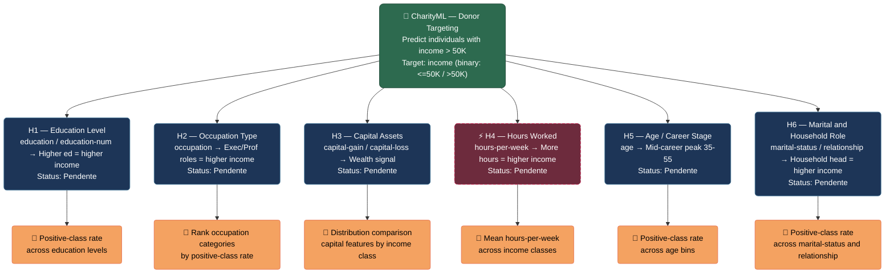

# Hypothesis Map — Finding Donors for CharityML

> Mapa visual das hipóteses iniciais levantadas antes de qualquer análise de dados,
> seguindo a disciplina CRISP-DM de separar o raciocínio a priori dos achados empíricos.

## Mapa Mental das Hipóteses

## Hipóteses — Referência Rápida

| # | Nome Curto | Variável | Direção Esperada | Método de Teste | Status |
|---|---|---|---|---|---|
| H1 | Education Level | `education` / `education-num` | Higher education → higher P(income >50K) | Positive-class rate across education levels | Pendente |
| H2 | Occupation Type | `occupation` | Exec/Prof/Specialty roles → higher income | Rank occupation categories by positive-class rate | Pendente |
| H3 | Capital Assets | `capital-gain` / `capital-loss` | Non-zero capital activity → higher income | Distribution comparison by income class | Pendente |
| H4 ⚡ | Hours Worked | `hours-per-week` | More hours → higher income (may not hold for salaried) | Mean hours-per-week across income classes | Pendente |
| H5 | Age / Career Stage | `age` | Mid-career (35–55) → peak income probability | Positive-class rate across age bins | Pendente |
| H6 | Marital & Household Role | `marital-status` / `relationship` | Married household head → higher income | Positive-class rate across marital-status and relationship | Pendente |

## Legenda

| Cor do nó | Significado |
|---|---|
| Verde escuro | Problem Statement |
| Azul escuro | Hipótese pendente |
| Vermelho bordô (tracejado) | Hipótese contrarian |
| Verde água | Hipótese confirmada |
| Vermelho | Hipótese refutada |
| Laranja | Método de teste |

---

*Gerado pelo skill `/hypothesis-map` — atualizar manualmente o Status conforme os achados da análise avançam.*
