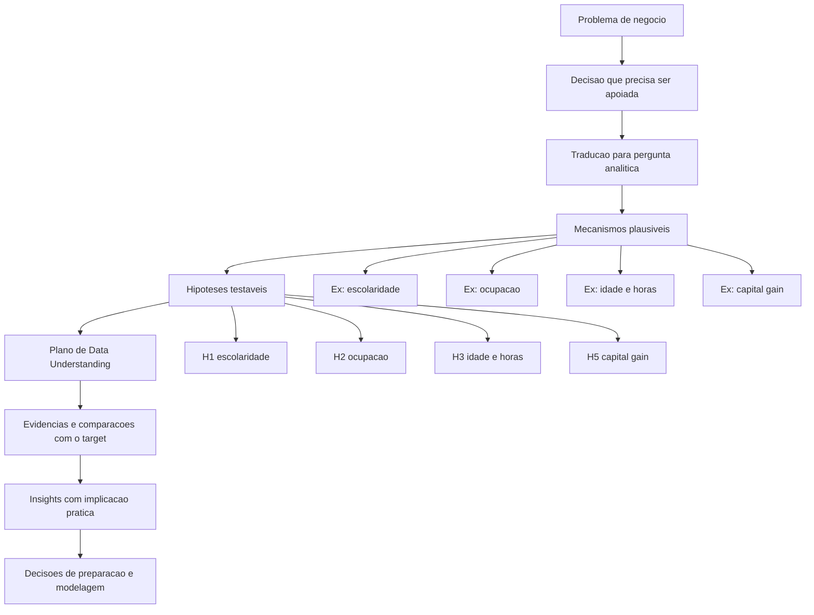
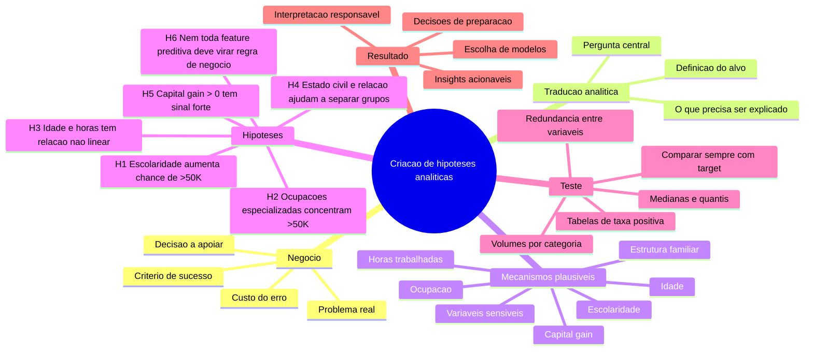

# Guia de Hipoteses Analiticas

Este documento foi criado para ajudar um cientista de dados em inicio de amadurecimento analitico a sair de uma exploracao reativa do dataset e passar a conduzir a analise com intencao.

O principio central e simples:

**Hipotese analitica nao e um chute. E uma suspeita estruturada, conectada ao negocio, que pode ser investigada com dados e que ajuda a decidir o que vale a pena analisar primeiro.**

## 1. Por que criar hipoteses antes de explorar os dados

Sem hipoteses, a etapa de Data Understanding costuma virar uma sequencia de:
- muitos graficos;
- pouca interpretacao;
- repeticao do mesmo insight;
- descobertas que nao mudam nenhuma decisao.

Com hipoteses, a analise muda de postura:
- sai de "vou olhar tudo";
- vai para "vou investigar o que pode explicar melhor o problema de negocio".

No projeto `Finding Donors`, isso e especialmente importante porque o objetivo nao e descrever o censo inteiro. O objetivo e entender quais perfis ajudam a separar melhor pessoas com renda `>50K`, ja que essa faixa e usada como proxy de maior potencial de doacao.

## 2. O que e uma boa hipotese analitica

Uma boa hipotese analitica tem cinco caracteristicas:

1. Nasce de uma pergunta de negocio.
2. Aponta uma relacao esperada entre variaveis e alvo.
3. Pode ser investigada com os dados disponiveis.
4. Gera uma acao analitica clara.
5. Pode ser confirmada, refinada ou descartada.

### Estrutura pratica

Use este molde:

> "Acredito que `variavel ou grupo de variaveis` tenha relacao com `alvo`, porque `racional de negocio`. Vou investigar isso comparando `evidencias ou cortes analiticos`."

### Exemplo generico

> "Acredito que clientes com maior tempo de relacionamento tenham maior chance de renovacao, porque relacoes mais longas indicam maior fidelizacao. Vou investigar isso comparando a taxa de renovacao por faixa de tempo de casa."

## 3. O que nao e hipotese

Estes exemplos parecem analiticos, mas ainda nao sao boas hipoteses:

- "Vou fazer um histograma de idade."
- "Vou ver a correlacao entre tudo."
- "Vou analisar as variaveis categoricas."
- "A feature X parece importante."

Isso descreve uma tecnica, nao uma pergunta analitica.

Hipotese boa:

- "Acredito que idade esteja associada a maior renda ate certo ponto da carreira, e por isso quero comparar a taxa de `>50K` por faixas etarias."

## 4. Processo pratico para criar hipoteses

## 4.1 Comece pelo negocio

Antes de olhar o dataset, responda:
- Qual decisao o modelo ou analise precisa apoiar?
- O que significa sucesso para o negocio?
- Qual erro custa mais caro?
- O que seria um resultado util de verdade?

No `Finding Donors`:
- decisao: quem priorizar para campanhas de captacao;
- sucesso: encontrar perfis mais promissores sem desperdicar cartas;
- erro mais caro: falso positivo em excesso;
- resultado util: lista mais precisa de pessoas com maior chance de pertencer a faixa `>50K`.

## 4.2 Traduza o problema para uma pergunta analitica

Pergunta de negocio:

> "Quem deve receber prioridade na campanha?"

Pergunta analitica:

> "Quais caracteristicas ajudam a diferenciar individuos com renda `>50K`?"

## 4.3 Liste mecanismos plausiveis

Agora pense como cientista de dados senior:

- Quais fatores, do ponto de vista economico ou social, poderiam explicar o alvo?
- Quais variaveis do dataset representam esses fatores?
- Quais dessas variaveis podem ter sinal forte, fraco, nao linear ou enviesado?

No projeto, alguns mecanismos plausiveis sao:
- escolaridade pode influenciar renda;
- ocupacao pode refletir senioridade e faixa salarial;
- idade pode capturar estagio de carreira;
- horas trabalhadas podem refletir intensidade de trabalho ou perfil ocupacional;
- capital gain pode indicar situacao financeira diferenciada;
- estado civil e relacao familiar podem refletir contexto economico do individuo.

## 4.4 Transforme mecanismos em hipoteses testaveis

O salto importante e este:

Nao basta dizer "escolaridade importa".

Melhor dizer:

> "Acredito que maior escolaridade esteja associada a maior probabilidade de renda `>50K`, porque niveis educacionais mais altos costumam ampliar acesso a ocupacoes mais qualificadas. Vou investigar isso comparando taxa positiva por `education_level` e `education-num`."

## 4.5 Defina como investigar

Toda hipotese deve gerar uma acao objetiva de Data Understanding.

Pergunte:
- Qual tabela eu preciso montar?
- Qual comparacao eu preciso fazer?
- Preciso de grafico mesmo ou uma tabela resolve?
- Se a hipotese for forte, o que isso muda na preparacao ou modelagem?

## 5. Exemplo completo com o projeto Finding Donors

## 5.1 Problema de negocio

A CharityML quer priorizar pessoas com maior probabilidade de contribuir, reduzindo desperdicio de outreach. Como nao temos o dado de doacao diretamente, usamos renda `>50K` como proxy de maior capacidade de doacao.

## 5.2 Pergunta analitica central

> Quais variaveis ajudam a separar melhor pessoas com renda `>50K` de pessoas com renda `<=50K`?

## 5.3 Hipoteses do projeto e como elas foram construidas

### Hipotese H1

**Hipotese**

Maior escolaridade esta associada a maior probabilidade de renda `>50K`.

**Como essa hipotese nasceu**

- negocio: precisamos identificar perfis com maior chance de renda alta;
- mecanismo plausivel: educacao amplia acesso a empregos mais qualificados;
- variaveis disponiveis: `education_level` e `education-num`;
- teste analitico: comparar taxa de `>50K` por categoria e por nivel ordinal.

**O que essa hipotese muda no Data Understanding**

- analisar `education_level` e `education-num` cedo;
- verificar se ha redundancia entre as duas;
- observar se uma delas ja entrega o sinal principal para modelagem.

### Hipotese H2

**Hipotese**

Ocupacoes de maior senioridade ou especializacao tendem a concentrar mais individuos com renda `>50K`.

**Como essa hipotese nasceu**

- negocio: renda alta provavelmente se relaciona ao tipo de ocupacao;
- mecanismo plausivel: cargos executivos e tecnicos especializados tendem a pagar melhor;
- variavel disponivel: `occupation`;
- teste analitico: calcular volume, positivos e taxa positiva por ocupacao.

**O que essa hipotese muda no Data Understanding**

- evita grafico de contagem isolado;
- foca em taxa positiva por ocupacao;
- separa categorias com taxa alta real de categorias raras.

### Hipotese H3

**Hipotese**

Idade e horas por semana possuem relacao com renda, mas nao de forma linear simples.

**Como essa hipotese nasceu**

- negocio: estagio de carreira e intensidade de trabalho podem influenciar remuneracao;
- mecanismo plausivel: perfis muito jovens tendem a ganhar menos; faixas intermediarias podem concentrar pico de renda; jornadas mais longas podem sinalizar maior renda em alguns contextos;
- variaveis disponiveis: `age` e `hours-per-week`;
- teste analitico: comparar medianas, quantis e taxas por faixas.

**O que essa hipotese muda no Data Understanding**

- pede comparacao por classe e por faixa;
- evita depender so de histograma bruto;
- ajuda a pensar em transformacoes, binning ou interpretacao nao linear.

### Hipotese H4

**Hipotese**

Variaveis de estrutura familiar e conjugal ajudam a diferenciar grupos com renda distinta.

**Como essa hipotese nasceu**

- negocio: arranjos familiares podem refletir contexto economico e ciclo de vida;
- mecanismo plausivel: certos perfis conjugais podem aparecer com mais frequencia na classe positiva;
- variaveis disponiveis: `marital-status` e `relationship`;
- teste analitico: comparar taxa de `>50K` por categoria e verificar sobreposicao de informacao.

**O que essa hipotese muda no Data Understanding**

- orienta investigacao de sinal real versus redundancia;
- ajuda a decidir se as duas colunas devem permanecer juntas.

### Hipotese H5

**Hipotese**

Eventos financeiros raros, como `capital-gain > 0`, podem ter forte poder discriminativo.

**Como essa hipotese nasceu**

- negocio: sinais financeiros diretos podem separar melhor a classe positiva;
- mecanismo plausivel: quem registra ganho de capital pode ter perfil economico diferente da media;
- variaveis disponiveis: `capital-gain` e `capital-loss`;
- teste analitico: medir proporcao de zeros, assimetria e taxa positiva quando ha valor acima de zero.

**O que essa hipotese muda no Data Understanding**

- justifica analisar distribuicao com objetivo claro;
- sustenta eventual log-transformacao;
- evita fazer grafico "porque a variavel e numerica".

### Hipotese H6

**Hipotese**

Nem toda variavel com poder preditivo deve ser tratada como automaticamente desejavel para decisao.

**Como essa hipotese nasceu**

- negocio: performance sem responsabilidade pode gerar risco reputacional e vies;
- mecanismo plausivel: `sex`, `race` e `native-country` podem aparecer como sinal forte, mas exigem cautela;
- variaveis disponiveis: `sex`, `race`, `native-country`;
- teste analitico: observar sinal, volume e impacto potencial sem assumir uso cego na decisao.

**O que essa hipotese muda no Data Understanding**

- introduz camada de analise responsavel;
- diferencia "serve para prever" de "deve orientar acao".

## 6. Como usar hipoteses para guiar o Data Understanding

Aqui esta a grande mudanca de maturidade analitica:

**Voce nao abre o dataset para procurar qualquer coisa interessante.**

**Voce abre o dataset para testar hipoteses com valor para o negocio.**

### Em vez de fazer isso

- contar categorias de todas as colunas;
- plotar histogramas de tudo;
- gerar pairplot completo;
- montar heatmap gigante de correlacao;
- repetir tres graficos para mostrar o mesmo ponto.

### Faca isso

1. Verifique sanidade estrutural da base.
2. Entenda a distribuicao do alvo.
3. Priorize variaveis ligadas as hipoteses.
4. Compare sempre com o target.
5. Feche cada analise com uma implicacao.

### Exemplo de raciocinio correto

Pergunta:

> "Escolaridade parece separar a classe positiva?"

Analise adequada:

- taxa de `>50K` por `education_level`;
- resumo por `education-num` separado por target;
- verificacao de redundancia entre `education_level` e `education-num`.

Conclusao util:

- "Existe sinal forte e redundancia parcial; vale manter as duas no inicio, mas monitorar importancia e possivel simplificacao na etapa de modelagem."

## 7. Checklist de formulacao de hipoteses

Antes de incluir uma hipotese no notebook, valide:

- Ela nasce de uma necessidade do negocio?
- Ela menciona uma relacao esperada com o alvo?
- Existe variavel no dataset para investigar isso?
- Eu sei como testar essa hipotese?
- Se eu confirmar ou refutar isso, alguma decisao muda?

Se a resposta para a ultima pergunta for "nao", provavelmente a hipotese ainda esta fraca.

## 8. Erros comuns de quem ainda nao tem essa maturidade analitica

### Erro 1: confundir curiosidade com prioridade

Nem tudo que parece interessante e relevante para o problema.

### Erro 2: analisar distribuicao sem analisar relacao com o alvo

Saber que uma categoria e comum nao diz, por si so, se ela ajuda a separar a classe positiva.

### Erro 3: usar grafico como prova de profundidade

Volume de grafico nao e sinal de qualidade analitica.

### Erro 4: nao fechar a analise com uma implicacao

Insight sem consequencia pratica e observacao solta.

### Erro 5: ignorar variaveis sensiveis

Mesmo quando ajudam o modelo, elas exigem criterio de uso e interpretacao.

## 9. Fluxo visual do processo analitico

## 10. Mindmap do processo de criacao de hipoteses

## 11. Regra final para levar para qualquer projeto

Se voce quiser uma regra curta para memorizar, use esta:

> **Hipotese boa conecta negocio, mecanismo plausivel, dado disponivel e decisao analitica.**

Quando essa conexao aparece, a exploracao deixa de ser barulho e passa a produzir direcao.

## 12. Sugestao de uso dentro deste projeto

Este guia conversa diretamente com:
- [Finding_Donors_Project.md](/home/fabiolima/Desktop/Finding_Donors_Project/Finding_Donors_Project.md)
- [finding_donors_version_study.ipynb](/home/fabiolima/Desktop/Finding_Donors_Project/finding_donors_version_study.ipynb)

Uso recomendado:
- ler este guia antes de iniciar o Data Understanding;
- copiar a estrutura de pensamento para a secao de Business Understanding;
- registrar no notebook apenas hipoteses que gerem analise util;
- usar o mindmap como referencia rapida durante a exploracao.
